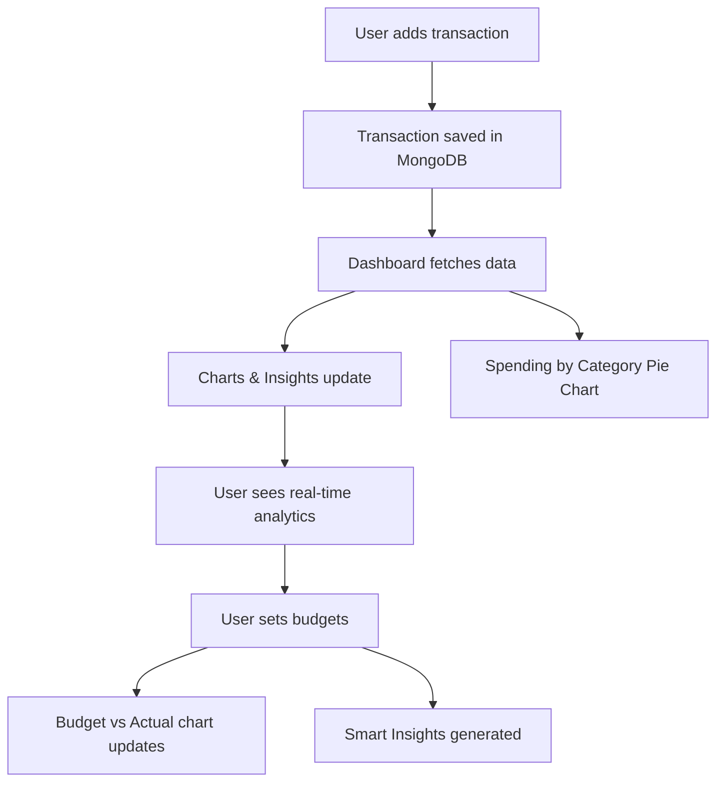

# 💸 Finance Visualizer


<p align="center">
  
  
  
  
  
</p>

---

## 🚀 Project Overview

**Finance Visualizer** is a modern, full-stack web app for tracking your expenses, setting monthly budgets, and visualizing your financial health with beautiful charts and insights.

- 📊 **Dashboard** with real-time analytics
- 💰 **Transactions** tracking with categories
- 🎯 **Budgets** per category per month
- 🥧 **Pie & Bar Charts** for spending breakdown
- 🧠 **Smart Insights** (e.g., "You've exceeded your budget in Food by ₹1,200")
- 📱 **Responsive**: Works on mobile & desktop

---

## ✨ Features

- [x] Add, edit, delete transactions
- [x] Set monthly budgets by category
- [x] Dashboard with summary cards
- [x] Category-wise pie chart
- [x] Budget vs Actual bar chart
- [x] Spending insights (over/under budget)
- [x] Search, filter, and responsive navigation
- [x] Modern UI with shadcn/ui & Tailwind CSS

---

## 🖼️ Screenshots

### Dashboard


### Transactions


### Budgets


### Mobile View


> _Replace these with your actual screenshots in the `public/screens/` folder._

---

## 🛠️ Tech Stack

<p align="center">
  
</p>

- **Next.js 15** (App Router, API routes)
- **MongoDB** (Mongoose ODM)
- **shadcn/ui** (Radix + Tailwind components)
- **Recharts** (for charts)
- **TypeScript** (type safety)
- **Vercel** (deployment-ready)

---

## 🧩 Animated Workflow



---

## 📝 How It Works

1. **Add Transactions**: Enter amount, date, category, and description.
2. **Set Budgets**: Choose a category, set a monthly limit.
3. **Dashboard**: See total expenses, category breakdown, and budget vs actual.
4. **Insights**: Get instant feedback if you're over or under budget.
5. **Mobile Friendly**: Use on any device, anywhere.

---

## 📦 Installation & Setup

```bash
# 1. Clone the repo
$ git clone https://github.com/yourusername/finance-visualizer.git
$ cd finance-visualizer

# 2. Install dependencies
$ npm install

# 3. Set up environment variables
$ cp .env.example .env.local
# Edit .env.local with your MongoDB URI

# 4. Start the dev server
$ npm run dev
```

---

## 📚 Usage Guide

- **Transactions**: Add, edit, delete, and search your expenses.
- **Budgets**: Set monthly budgets for each category.
- **Dashboard**: Visualize your spending and get actionable insights.
- **Charts**: Interactive bar and pie charts for deep analysis.
- **Insights**: See if you're on track or over budget, per category.

---

## 📊 Example Charts

### Category Pie Chart


### Budget vs Actual Bar Chart


---

## 📱 Responsive Design

- Fully mobile-friendly
- Hamburger menu for navigation
- Touch-friendly forms and charts

---

## 🤝 Contributing

1. Fork this repo
2. Create a feature branch
3. Commit your changes
4. Open a pull request

---

## 📝 License

MIT License. See [LICENSE](LICENSE) for details.

---

## 🙏 Credits

- [shadcn/ui](https://ui.shadcn.com/)
- [Recharts](https://recharts.org/)
- [Radix UI](https://www.radix-ui.com/)
- [Lucide Icons](https://lucide.dev/)
- [Tailwind CSS](https://tailwindcss.com/)

---

## 🌟 Project Status

> **Finance Visualizer** is production-ready and actively maintained. PRs and feedback welcome!

---

<p align="center">
  
</p>
